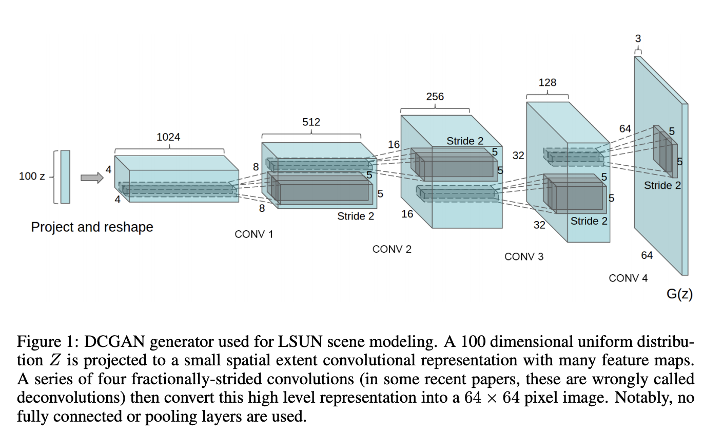
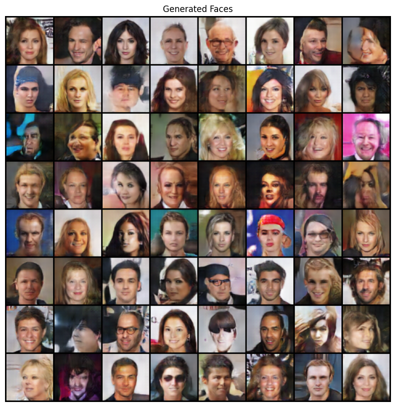
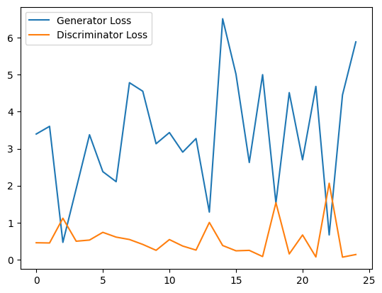

# **DCGAN for Face Generation using the CELEBA Dataset**  

## **Introduction**  
This experiment focuses on implementing a Deep Convolutional Generative Adversarial Network (DCGAN) to generate realistic human faces using the CELEBA dataset. The model consists of a generator and a discriminator, both trained using PyTorch.  

##**DCGAN Architecture**
  

## **Dataset Preprocessing Steps**  
1. **Download the Dataset**: Retrieve the CELEBA dataset from Kaggle.  
2. **Image Processing**: Resize all images to **64x64** resolution.  
3. **Normalization**: Convert images into tensors and normalize pixel values to the range **[-1, 1]**.  
4. **Efficient Data Loading**: Use PyTorch’s **DataLoader** for optimized batch processing.  

## **Training the Model**  
1. **Set Hyperparameters**: Define batch size, learning rate, and the number of training epochs.  
2. **Model Initialization**: Construct the generator and discriminator networks.  
3. **Loss Functions & Optimizers**: Set up the loss functions and optimizers for both networks.  
4. **Training Process**:  
   - Train the **discriminator** to distinguish between real and generated images.  
   - Train the **generator** to create realistic images that can fool the discriminator.  
5. **Saving the Model**: Store the trained models as `generator.pth` and `discriminator.pth`.  
6. **Tracking Progress**: Generate and save sample images after each epoch to visualize improvements.  

## **Testing the Model**  
1. Load the trained **generator** model.  
2. Generate new images using random noise as input.  
3. Save and display the generated images.  

## **Expected Outputs**  
- The model will progressively improve in generating realistic human faces.  
- The **loss curves** will show both generator and discriminator losses decreasing and stabilizing.  

### **Sample Generated Image**  
  

### **Loss Curve**  
  

## **Requirements**  
- Python 3.x  
- PyTorch  
- torchvision  
- Matplotlib  
- PIL  
- Kaggle API (for dataset download)  

## **How to Run**  
1. **Clone the repository**:  
   ```bash
   git clone https://github.com/your-repo/DCGAN-Face-Generation.git
   cd DCGAN-Face-Generation
   ```  
2. **Install dependencies**:  
   ```bash
   pip install -r requirements.txt
   ```  
3. **Train the model**:  
   ```bash
   python train.py
   ```  
4. **Generate images using the trained model**:  
   ```bash
   python generate.py
   ```  

## **Code Documentation Requirements**  
- **Docstrings & Inline Comments**: All Python scripts should contain docstrings and comments explaining functions and logic.  
- **Best Practices**: Ensure clean, modular, and reusable code.  
- **README.md**: This file provides detailed explanations of:  
  - **Dataset preprocessing steps**  
  - **Training and testing the model**  
  - **Expected outputs**  

## **Conclusion**  
This experiment successfully demonstrates how DCGANs can generate human-like face images from random noise using the CELEBA dataset. With sufficient training, the generator learns to produce highly realistic facial features.  
